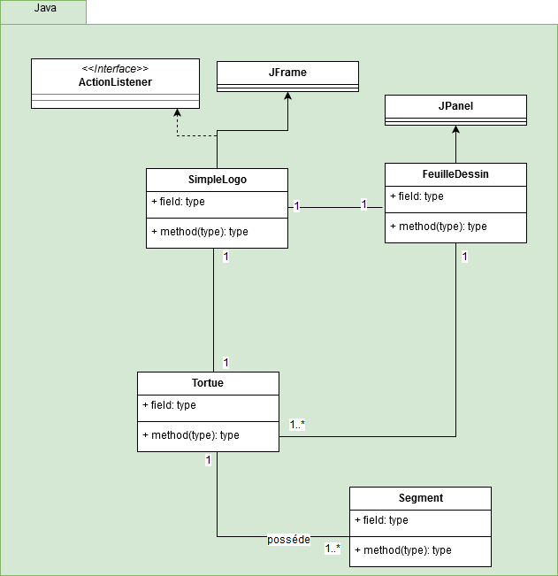

**MARTIN Gaetan :**

**JOYMANGUL Jensen :**

# Rapport TP4

## Question 1
Les améliorations possibles sont répertoriées dans les issues de GitHub

https://github.com/PolytechLyon/4a-isi3-tp4-2016-2017-groupe-1-martin_joymangul/issues

## Question 2
###Motif avant le refactoring

###Motif aprés refactoring
## Question 3
*Rien à rédiger*

## Question 4
*Rien à rédiger*

## Question 5
*Expliquer le code ajouté et représenter le patron de conception*

## Question 6
*Rien à rédiger*

## Question 7
*Rien à rédiger*

## Question 8
*Expliquer l'intérêt du mock*

## Question 9
*Montrer les résultats de vos rapports d'analyse*

## Question 10
*Rien à rédiger*
